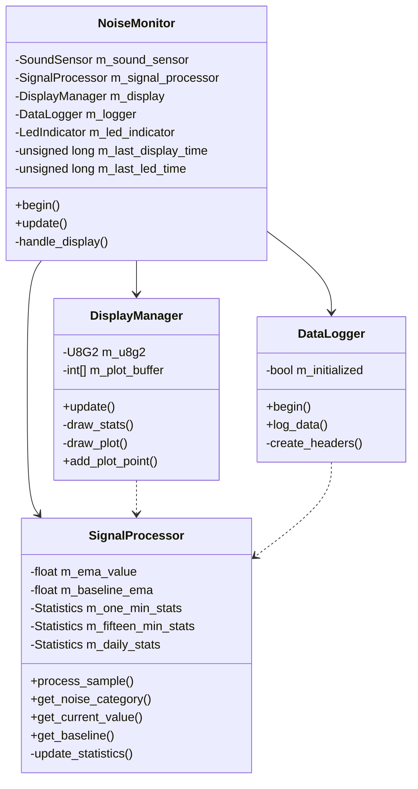

# Component Architecture

```mermaid
classDiagram
class NoiseMonitor {
    -SoundSensor m_sound_sensor
    -SignalProcessor m_signal_processor
    -DisplayManager m_display
    -DataLogger m_logger
    -LedIndicator m_led_indicator
    -unsigned long m_last_display_time
    -unsigned long m_last_led_time
    +begin()
    +update()
    -handle_display()
}

class SignalProcessor {
    -float m_ema_value
    -float m_baseline_ema
    -Statistics m_one_min_stats
    -Statistics m_fifteen_min_stats
    -Statistics m_daily_stats
    +process_sample()
    +get_noise_category()
    +get_current_value()
    +get_baseline()
    -update_statistics()
}

class DisplayManager {
    -U8G2 m_u8g2
    -int[] m_plot_buffer
    +update()
    -draw_stats()
    -draw_plot()
    +add_plot_point()
}

class DataLogger {
    -bool m_initialized
    +begin()
    +log_data()
    -create_headers()
}

NoiseMonitor --> SignalProcessor
NoiseMonitor --> DisplayManager
NoiseMonitor --> DataLogger
DisplayManager ..> SignalProcessor
DataLogger ..> SignalProcessor

```
