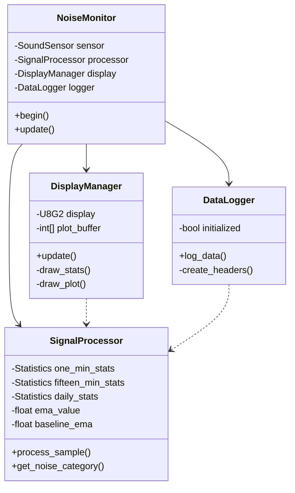

# Component Architecture

```mermaid
classDiagram
class NoiseMonitor {
-SoundSensor sensor
-SignalProcessor processor
-DisplayManager display
-DataLogger logger
+begin()
+update()
}

    class SignalProcessor {
        -Statistics one_min_stats
        -Statistics fifteen_min_stats
        -Statistics daily_stats
        -float ema_value
        -float baseline_ema
        +process_sample()
        +get_noise_category()
    }

    class DisplayManager {
        -U8G2 display
        -int[] plot_buffer
        +update()
        -draw_stats()
        -draw_plot()
    }

    class DataLogger {
        -bool initialized
        +log_data()
        -create_headers()
    }

    NoiseMonitor --> SignalProcessor
    NoiseMonitor --> DisplayManager
    NoiseMonitor --> DataLogger
    DisplayManager ..> SignalProcessor
    DataLogger ..> SignalProcessor

```
