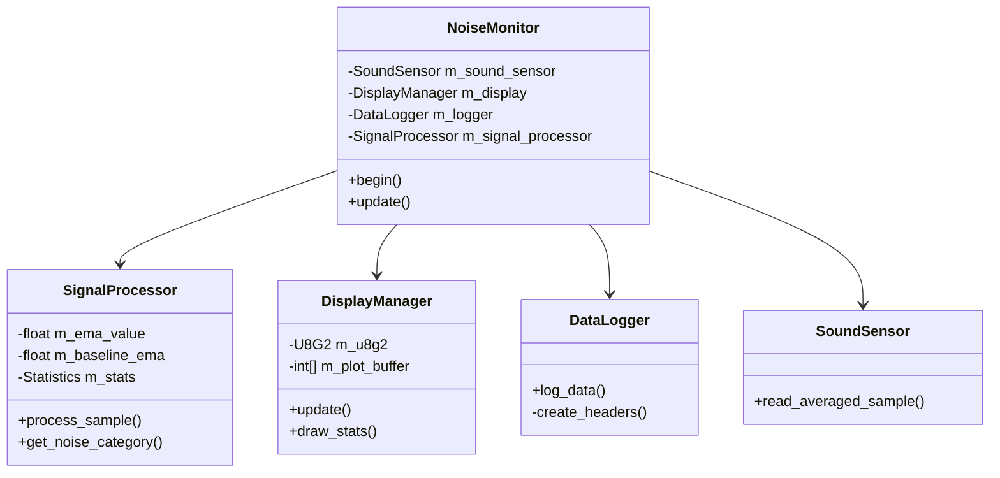

```mermaid
classDiagram
class NoiseMonitor {
-SoundSensor m_sound_sensor
-DisplayManager m_display
-DataLogger m_logger
-SignalProcessor m_signal_processor
+begin()
+update()
}

    class SignalProcessor {
        -float m_ema_value
        -float m_baseline_ema
        -Statistics m_stats
        +process_sample()
        +get_noise_category()
    }

    class DisplayManager {
        -U8G2 m_u8g2
        -int[] m_plot_buffer
        +update()
        +draw_stats()
    }

    class DataLogger {
        +log_data()
        -create_headers()
    }

    class SoundSensor {
        +read_averaged_sample()
    }

    NoiseMonitor --> SignalProcessor
    NoiseMonitor --> DisplayManager
    NoiseMonitor --> DataLogger
    NoiseMonitor --> SoundSensor

```
