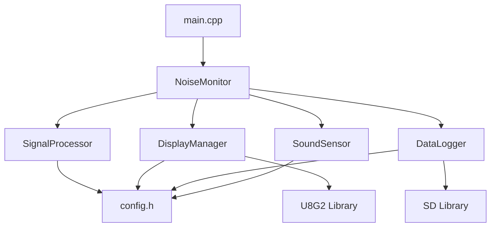

```mermaid
graph TD
A[main.cpp] --> B[NoiseMonitor]
B --> C[SignalProcessor]
B --> D[DisplayManager]
B --> E[DataLogger]
B --> F[SoundSensor]

    C --> G[config.h]
    D --> G
    E --> G
    F --> G

    D --> H[U8G2 Library]
    E --> I[SD Library]
```
