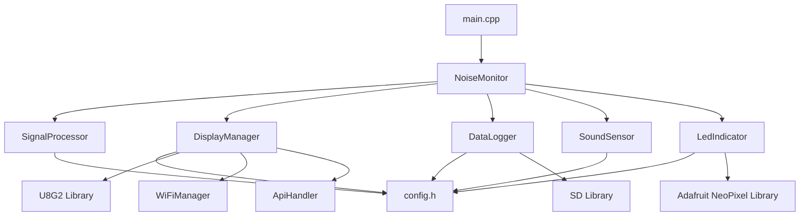

# Component Dependencies

```mermaid
graph TD
A[main.cpp] --> B[NoiseMonitor]
B --> C[SignalProcessor]
B --> D[DisplayManager]
B --> E[DataLogger]
B --> F[SoundSensor]
B --> J[LedIndicator]

C --> G[config.h]
D --> G
E --> G
F --> G
J --> G

D --> H[U8G2 Library]
D --> L[WiFiManager]
D --> M[ApiHandler]
E --> I[SD Library]
J --> K[Adafruit NeoPixel Library]
```
