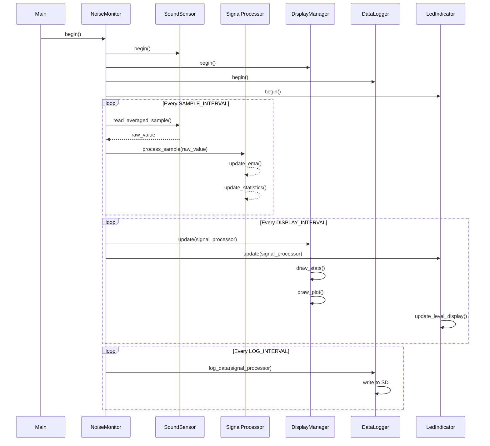

```mermaid
sequenceDiagram
participant Main
participant NoiseMonitor
participant SoundSensor
participant SignalProcessor
participant DisplayManager
participant DataLogger
participant LedIndicator

    Main->>NoiseMonitor: begin()
    NoiseMonitor->>SoundSensor: begin()
    NoiseMonitor->>DisplayManager: begin()
    NoiseMonitor->>DataLogger: begin()
    NoiseMonitor->>LedIndicator: begin()

    loop Every SAMPLE_INTERVAL
        NoiseMonitor->>SoundSensor: read_averaged_sample()
        SoundSensor-->>NoiseMonitor: raw_value
        NoiseMonitor->>SignalProcessor: process_sample(raw_value)
        SignalProcessor-->>SignalProcessor: update_ema()
        SignalProcessor-->>SignalProcessor: update_statistics()
    end

    loop Every DISPLAY_INTERVAL
        NoiseMonitor->>DisplayManager: update(signal_processor)
        NoiseMonitor->>LedIndicator: update(signal_processor)
        DisplayManager->>DisplayManager: draw_stats()
        DisplayManager->>DisplayManager: draw_plot()
        LedIndicator->>LedIndicator: update_level_display()
    end

    loop Every LOG_INTERVAL
        NoiseMonitor->>DataLogger: log_data(signal_processor)
        DataLogger->>DataLogger: write to SD
    end
```
