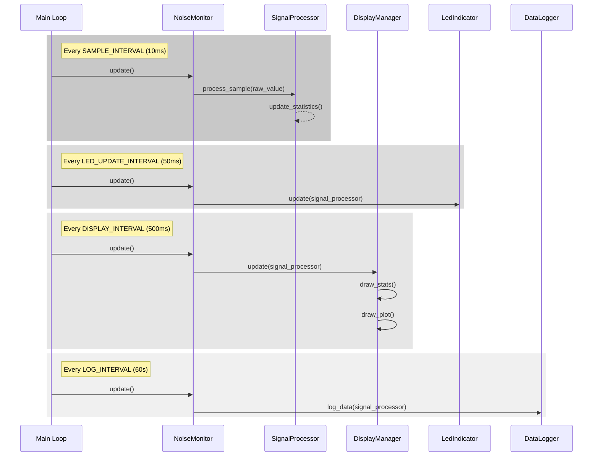

# Timing and Flow

```mermaid
sequenceDiagram
    participant M as Main Loop
    participant NM as NoiseMonitor
    participant SP as SignalProcessor
    participant DM as DisplayManager
    participant LI as LedIndicator
    participant DL as DataLogger

    rect rgb(200, 200, 200)
        note right of M: Every SAMPLE_INTERVAL (10ms)
        M->>NM: update()
        NM->>SP: process_sample(raw_value)
        SP-->>SP: update_statistics()
    end

    rect rgb(220, 220, 220)
        note right of M: Every LED_UPDATE_INTERVAL (50ms)
        M->>NM: update()
        NM->>LI: update(signal_processor)
    end

    rect rgb(230, 230, 230)
        note right of M: Every DISPLAY_INTERVAL (500ms)
        M->>NM: update()
        NM->>DM: update(signal_processor)
        DM->>DM: draw_stats()
        DM->>DM: draw_plot()
    end

    rect rgb(240, 240, 240)
        note right of M: Every LOG_INTERVAL (60s)
        M->>NM: update()
        NM->>DL: log_data(signal_processor)
    end
```
