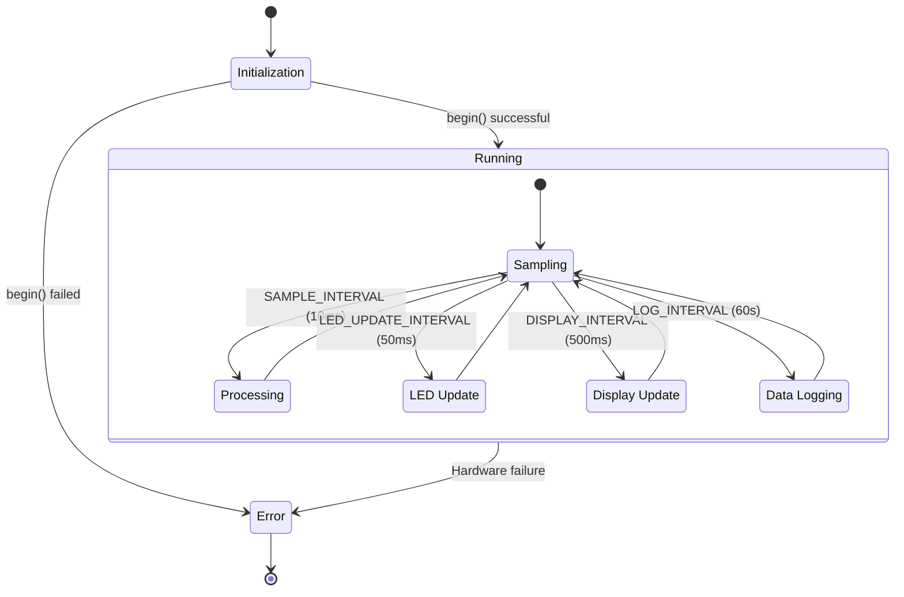

# State Management

```mermaid
stateDiagram-v2
    [*] --> Initialization
    Initialization --> Running: begin() successful
    Initialization --> Error: begin() failed

    state Running {
        [*] --> Sampling
        Sampling --> Processing: SAMPLE_INTERVAL (10ms)
        Processing --> Sampling

        state "LED Update" as LED
        Sampling --> LED: LED_UPDATE_INTERVAL (50ms)
        LED --> Sampling

        state "Display Update" as DU
        Sampling --> DU: DISPLAY_INTERVAL (500ms)
        DU --> Sampling

        state "Data Logging" as DL
        Sampling --> DL: LOG_INTERVAL (60s)
        DL --> Sampling
    }

    Error --> [*]
    Running --> Error: Hardware failure
```
