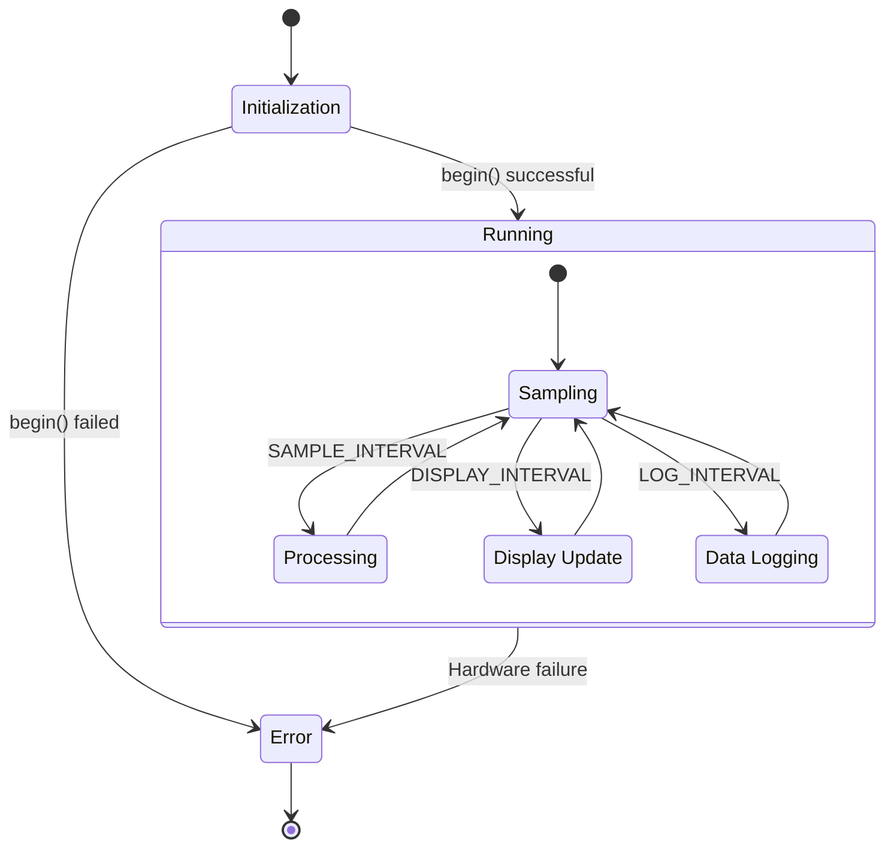

```mermaid
stateDiagram-v2
    [*] --> Initialization
    Initialization --> Running: begin() successful
    Initialization --> Error: begin() failed

    state Running {
        [*] --> Sampling
        Sampling --> Processing: SAMPLE_INTERVAL
        Processing --> Sampling

        state "Display Update" as DU
        Sampling --> DU: DISPLAY_INTERVAL
        DU --> Sampling

        state "Data Logging" as DL
        Sampling --> DL: LOG_INTERVAL
        DL --> Sampling
    }

    Error --> [*]
    Running --> Error: Hardware failure
```
